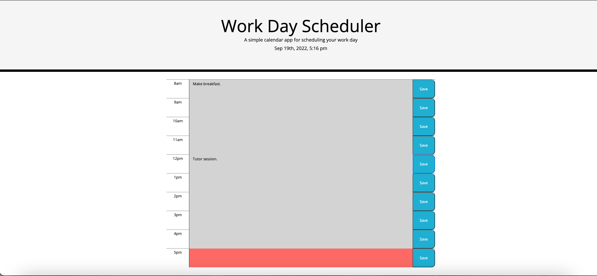

Single work day planner

Description 
This project was created to help people plan a single wokring day. It allows the user to input todo items at times and save to come back whenever it is needed. The site tracks the time and changes the schedule block to indicate weather the events are in the past, present, or future. The site is a simple way to plan a day without feeling overwhelmed about the entire week.

Live link:

Repo link:

License:
MIT